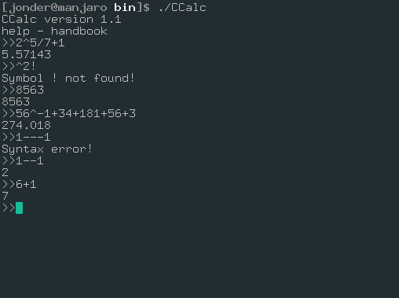

# CCALC

## CClac[Console-calc][C++-calc] - is simple,fast console calc.

## Example

## Math operations:
    +,
    -,
    *,
    /,
    ^(power)
  
## Commands:
    1.quit - exit from program
    2.help - handbook

## Mascot: :3

    
He is name Rommy!
  